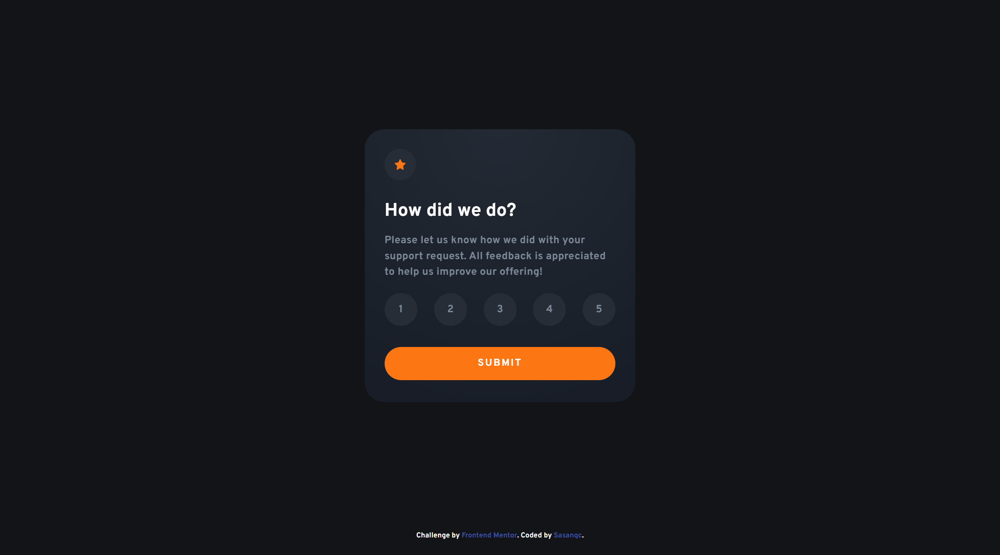
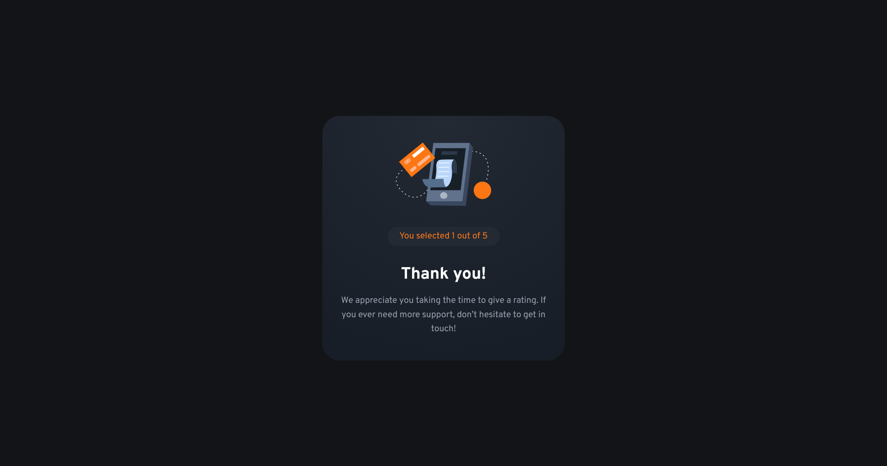

# Frontend Mentor - Interactive rating component solution

This is a solution to the [Interactive rating component challenge on Frontend Mentor](https://www.frontendmentor.io/challenges/interactive-rating-component-koxpeBUmI). Frontend Mentor challenges help you improve your coding skills by building realistic projects.

## Table of contents

- [Frontend Mentor - Interactive rating component solution](#frontend-mentor---interactive-rating-component-solution)
  - [Table of contents](#table-of-contents)
  - [Overview](#overview)
    - [The challenge](#the-challenge)
    - [Screenshot](#screenshot)
    - [Links](#links)
  - [My process](#my-process)
    - [Built with](#built-with)
    - [What I learned](#what-i-learned)
    - [Useful resources](#useful-resources)
  - [Author](#author)
  - [Acknowledgments](#acknowledgments)

**Note: Delete this note and update the table of contents based on what sections you keep.**

## Overview

### The challenge

Users should be able to:

- View the optimal layout for the app depending on their device's screen size
- See hover states for all interactive elements on the page
- Select and submit a number rating
- See the "Thank you" card state after submitting a rating

### Screenshot





### Links

Solution URL: [Frontend Mentor | Interactive rating component](https://www.frontendmentor.io/solutions/product-preview-card-component-z0BCForI0n)

- Live Site URL: [Interactive rating component](https://sasanqc.github.io/interactive-rating-component/)

## My process

- basic resets
- typography
- colors
- writing html
- css for desktop
- css for mobile
- adding some animation

### Built with

- Semantic HTML5 markup
- CSS custom properties
- Desktop-first workflow

### What I learned

I created a nice flipping card. it was a challenge form me.

```css
backface-visibility: hidden;
transform-style: preserve-3d;
transform: rotateY(180deg);
```

### Useful resources

- [How TO - Flip Card](https://www.w3schools.com/howto/howto_css_flip_card.asp) - This helped me to flip the card.

## Author

- Github - [@sasanqc](https://github.com/sasanqc/)
- Frontend Mentor - [@sasanqc](https://www.frontendmentor.io/profile/sasanqc)
- Twitter - [@sasanqc](https://www.twitter.com/sasanqc)
- Linkedin - [@sasanqc](https://www.linkedin.com/in/sasanqc)

## Acknowledgments
